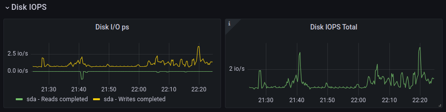

# LinuxMonitoring v2.0

Мониторинг и исследование состояния системы в реальном времени.

## Contents
1. [Генератор файлов](#part-1-генератор-файлов)  
2. [Засорение файловой системы](#part-2-засорение-файловой-системы)
3. [Очистка файловой системы](#part-3-очистка-файловой-системы)
4. [Генератор логов](#part-4-генератор-логов)
5. [Мониторинг](#part-5-мониторинг)
6. [GoAccess](#part-6-GoAccess)
7. [Prometheus и Grafana](#part-6-Prometheus-и-Grafana)
8. [Готовый дашборд](#part-6-Готовый-дашборд)
9. [Дополнительно. Свой node_exporter](#part-6-Дополнительно.-Свой-node_exporter)

## Part 1. Генератор файлов
#### **Задача**:
Написать bash-скрипт. Скрипт запускается с 6 параметрами. Пример запуска скрипта: \
`main.sh /opt/test 4 az 5 az.az 3kb`
#### **Решение**:
Блок-схема скрипта:

Расположение файлов скрипта: \
*LinuxMonitoring_v2.0-0/src/01/*

## Part 2. Засорение файловой системы
#### **Задача**:
Написать bash-скрипт. Скрипт запускается с 3 параметрами. Пример запуска скрипта: \
`main.sh az az.az 3Mb`
#### **Решение**:
Блок-схема скрипта:

Расположение файлов скрипта: \
*LinuxMonitoring_v2.0-0/src/02/*

## Part 3. Очистка файловой системы
#### **Задача**:
Написать bash-скрипт. Скрипт запускается с 1 параметром.
Скрипт должен уметь очистить систему от созданных в Part 2 папок и файлов 3 способами:
- По лог файлу;
- По дате и времени создания;
- По маске имени (т.е. символы, нижнее подчёркивание и дата).
#### **Решение**:
Блок-схема скрипта:

Расположение файлов скрипта: \
*LinuxMonitoring_v2.0-0/src/03/*

## Part 4. Генератор логов
#### **Задача**:
Написать bash-скрипт или программу на Си, генерирующий 5 файлов логов nginx в combined формате.
Каждый лог должен содержать информацию за 1 день.
#### **Решение**:
Блок-схема скрипта:

Расположение файлов скрипта: \
*LinuxMonitoring_v2.0-0/src/04/*

## Part 5. Мониторинг
#### **Задача**:
Написать bash-скрипт для разбора логов nginx из Части 4 через awk.
#### **Решение**:
Блок-схема скрипта:

Расположение файлов скрипта: \
*LinuxMonitoring_v2.0-0/src/05/*

## Part 6. GoAccess
#### **Задача**:
С помощью утилиты GoAccess получить ту же информацию, что и в *Части 5*
#### **Решение**:
Анализ log-файдов с помощью *GoAccess*:
- Выбор фомата log-файла: \
    
- Результат анализа: \
    

Команда `sudo goaccess [LOG FILE|FILES] --log-format=COMBINED -a -o informe.html` сгенерирует файл для отображения результата анализа в браузере.

*LinuxMonitoring_v2.0-0/src/06/informe.html* - пример файла-отчета.
## Part 7. Prometheus и Grafana
#### **Задача**:
1. Установить и настроить Prometheus и Grafana на виртуальную машину
2. Получить доступ к веб интерфейсам Prometheus и Grafana с локальной машины
#### **Решение**:
Запустим docker-контейнеры с необходимым совтом: \
*node-exporter* - сбор метрик \
*prometheus* - центральный сервер, предназначенный для сбора и хранения данных \
*grafana* - визуализация данных

Файл *docker-compose* - *LinuxMonitoring_v2.0-0/src/07/docker-compose.yml*
- Стартовая страница *Grafana*: \
    
- Стартовая страница *Prometheus*: \
    
- Стартовая страница *node-exporter*: \
    

Для настройки соединения *Prometheus*-*node-exporter* нужно отредактировать *config-file* *Prometheus*. Доступ к нему осуществляется через *docker-volume*, прописанный в файле *docker-compose.yml*.
- Внесённые изменения в *config-file* *Prometheus*: \
     \
    */var/lib/docker/volumes/06_prom-configs/_data/prometheus.yml*

После внесения изменений в *config-file* необходимо отправить в *docker-conteiner* сигнал `docker kill -s SIGHUP [CONTEINER NAME|ID]`
- Отображение подключения *Prometheus* к *node-exporter*: \
    

Для настройки *Grafana* нужно добавить источника данных (datasource). В качестве источника данных выбираем Prometheus и указываем URL http://localhost:9090. Остальные параметры оставляем по умолчанию.
- Подключение *Prometheus* к *Grafana*: \
    

После этих действий во вкладке *Configuration->Data sourses* отобразится *Prometheus*. Его можно использовать при подключении к приборным доскам.

- Отображение *Prometheus* в *Data sourses*: \
    
#### **Задача**:
Добавить на дашборд Grafana отображение ЦПУ, доступной оперативной памяти, свободное место и кол-во операций ввода/вывода на жестком диске
#### **Решение**:
Для решения этой задачи необходимо создать новый даш-борд, подключить *Prometheus* как источник данных и настроить панели отображения. 

После выполнения этих шагов результат будет выглядеть следующим образом:
- Отображение ЦПУ: \
    
- Доступная оперативная память: \
    
- Свободное место на жестком диске: \
    
- Кол-во операций ввода/вывода на жестком диске: \
    
- Настройка правил: \
    

Файл с параметрами дашборда - *LinuxMonitoring_v2.0-0/src/07/my_dashboard.json*
#### **Задача**:
Запустить ваш bash-скрипт из Части 2
#### **Решение**:
Для лучшего отображения установим в параметрах дашборда отображение метрик за посление 5 минут
- Отображение метрик: \
    

Зафиксируем параметры жесткого диска до запуска скрипта:
- Свободное место на жестком диске: \
    
- Кол-во операций ввода/вывода на жестком диске: \
    

Запуск скрипта "Засорение файловой системы":
- Команда `bash main.sh qwert asdf.oi 50Mb`

#### **Задача**:
Посмотреть на нагрузку жесткого диска (место на диске и операции чтения/записи)
#### **Решение**:
Параметры жесткого диска после запуска скрипта:
- Свободное место на жестком диске: \
    
- Кол-во операций ввода/вывода на жестком диске: \
    
#### **Задача**:
Установить утилиту stress и запустить команду `stress -c 2 -i 1 -m 1 --vm-bytes 32M -t 10s` \
Посмотреть на нагрузку жесткого диска, оперативной памяти и ЦПУ
#### **Решение**:
Параметры приборов дашборда после запуска *stress*:
- Отображение ЦПУ: \
    
- Доступная оперативная память: \
    
- Свободное место на жестком диске: \
    
- Кол-во операций ввода/вывода на жестком диске: \
    

Запустим скрипт "Очистка файловой системы". \
Параметры жесткого диска после запуска скрипта:
- Свободное место на жестком диске: \
    
- Кол-во операций ввода/вывода на жестком диске: \
    
## Part 8. Готовый дашборд
#### **Задача**:
Установить готовый дашборд *Node Exporter Quickstart and Dashboard* с официального сайта Grafana Labs
#### **Решение**:
Шаги установки и настройки:
1. Скачать json-файл с официального сайта Grafana Labs

    

2. В файле заменить переменные:
    - $node на $job
    - $instance на $node

    Отредактированный файл - */home/noisejaq/DO4_LinuxMonitoring_v2.0-0/src/08/node-exporter-quickstart-and-dashboard_rev2.json*
3. В *Grafana->Dashboards->Browse* выбрать *New->Import*

    
4. Скопировать содержимое json-файла в поле *Import via panel json*, нажать *load* и *import*

    
5. Сгенерируется новый дашборд. Для подключения к нему метрик нужно добавить в настройки следующие правила:

    
6. После этого на приборной доске удет отображаться актуальная информация:

    
#### **Задача**:
Провести те же тесты, что и в *Части 7*
#### **Решение**:
Зафиксируем параметры жесткого диска до запуска скрипта:
- Свободное место на жестком диске: \
    
- Кол-во операций ввода/вывода на жестком диске: \
    

Параметры жесткого диска после запуска скрипта "Засорение файловой системы":
- Свободное место на жестком диске: \
    
- Кол-во операций ввода/вывода на жестком диске: \
    

Параметры приборов дашборда после запуска `stress -c 2 -i 1 -m 1 --vm-bytes 32M -t 10s`:
- Отображение ЦПУ: \
    
- Доступная оперативная память: \
    
- Свободное место на жестком диске: \
    
- Кол-во операций ввода/вывода на жестком диске: \
    

Параметры жесткого диска после запуска скрипта "Очистка файловой системы":
- Свободное место на жестком диске: \
    
#### **Задача**:
Запустить ещё одну виртуальную машину, находящуюся в одной сети с текущей. \
Запустить тест нагрузки сети с помощью утилиты iperf3

#### **Решение**:
- Состояние дашбордов отображения нагрузки сети после запуска `iperf3`: \
    

## Part 9. Дополнительно. Свой *node_exporter*
#### **Задача**:
Написать bash-скрипт или программу на Си, которая собирает информацию по базовым метрикам системы (ЦПУ, оперативная память, жесткий диск (объем)).
Скрипт или программа должна формировать html страничку по формату **Prometheus**, которую будет отдавать **nginx**. 
Саму страничку обновлять можно как внутри bash-скрипта или программы (в цикле), так и при помощи утилиты cron, но не чаще, чем раз в 3 секунды.
#### **Решение**:
Описание решения:
- **metrics.sh** \
*bash*-скрипт. Осуществляет сбор метрик системы (CPU, RAM, Disk Memory), выводит метрики в терминал.
- **run.sh** \
*bash*-скрипт. Запускает *nginx*; каждые 5 sec запускает скрипт *metrics.sh* и перенаправляет вывод в файл *./www/metrics*
- **nginx** \
*nginx* при обращении к серверу по URL *http://[nginx_IP]:9200* возвращает html страничку по формату *Prometheus* с актуальными метриками.
- **dockerfile** \
За основу взят официальный *docker*-образ *nginx*. При сборке в него копируется скрипт по сбору метрик, возвращаемые html странички и *config*-файл.
- **docker-compose** \
За основу взят *docker-compose*-файл из *Part 7*. В нем реализована сборка образа *my_node-exporter* из *dockerfile* и доступ к развернутому контейнеру через порт 9200.

Перед запуском команды `docker-compose up` рекомендуется выполнить `docker-compose build` для сборки образа *my_node-exporter* (иначе выводится сообщение WARNING).
Во время выполнении команды `docker-compose up` разворачиваются все сервисы из *Part 7*, а так же сервис *my_node-exporter*.

- Страничка с метриками *my_node-exporter*: \
    

Расположение файлов:
- Настройки страничек и скрипт сборки метрик \
*LinuxMonitoring_v2.0-0/src/09/data/*

- *config*-файл с настройками *nginx* \
*LinuxMonitoring_v2.0-0/src/09/nginx/nginx.conf*

- *dockerfile* \
*LinuxMonitoring_v2.0-0/src/09/dockerfile*

- yml-файл *docker-compose* \
*LinuxMonitoring_v2.0-0/src/09/docker-compose.yml*

#### **Задача**:
Поменять конфигурационный файл Prometheus, чтобы он собирал информацию с созданной вами странички.
#### **Решение**:
Порядок действий:
- Запустить сервисы командой `docker-compose up -d`
- Добависть в *config*-файл *prometheus* адрес сервиса *my_node-exporter* (с него *prometheus* будет забирать метрики) : \
     \
    Доступ к *config*-файлу *prometheus* осуществляется через общий с хост-системой том. Расположение файла в хост-системе: */var/lib/docker/volumes/09_prom-configs/_data/prometheus.yml*

- Отправить в docker-conteiner сигнал `docker kill -s SIGHUP [CONTEINER NAME|ID]`

- Для отображения метрик через сервис *grafana* необходимо изменить переменные приборной доски:
    

#### **Задача**:
Провести те же тесты, что и в Части 7
#### **Решение**:
Запуск скрипта:
- Команда `bash main.sh qwert asdf.oi 50Mb`.\
- Параметры приборов дашборда после запуска скрипта "Засорение файловой системы" : \
    

Запуск команды `stress -c 2 -i 1 -m 1 --vm-bytes 32M -t 10s`. \
Параметры приборов дашборда после запуска *stress*: \

Параметры приборов дашборда после запуска скрипта "Очистка файловой системы": \
